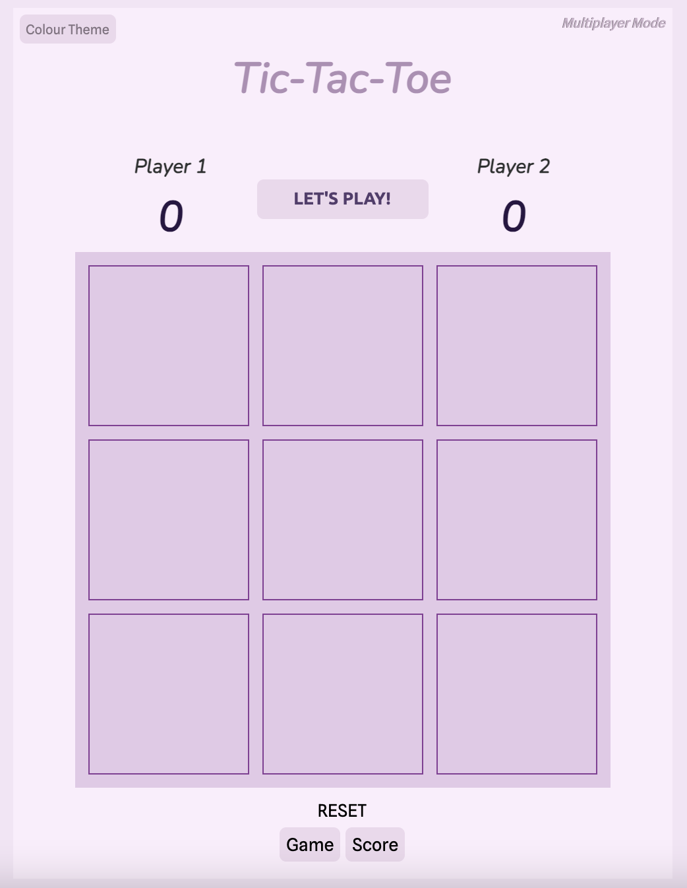
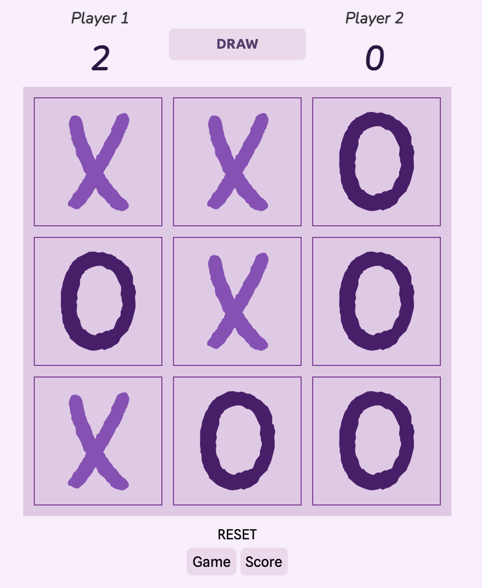

# T I C - T A C - T O E ! !

**Welcome to Tic-tac-toe game!**

You can play the game by clicking the link below :
[Link](https://casslee8757.github.io/tic-tac-toe/)

This game is my very first project that was built through a Software Engineering Immersive course from General Assembly in Sydney, Australia. The goal of this project is to enhance HTML, CSS and Javascript skills that we have learnt so far and to collaborate the knowledge for better task performance. 

**Descriptions**:
You can enjoy this game in 2 different ways: multiplayer mode and single-player mode. The default mode is a multiplayer mode and you can play this game with your friend. You can check the type of mode in the top right-handed corner and you can simply change the mode by clicking the text.

For multiplayer mode, you can simply start the game by clicking the grid boxes and player 1 goes always goes first. In the little screen between the scoreboard, you can find the updated status of the game and it will tell you who wins the game at the turn of each player.

For singleplayer mode, you need to choose the player you'd wish to play by clicking the Player 1 or Player 2 button and you can enjoy this mode with AI.

Lastly, in the top left-hand corner, there is a drop-down menu where you can set your colour theme for the game.

**Tech Specs:**
HTML, CSS, Javascript and Jquery was used in this project.

**List of bugs**:

1. Occasionally, in the situation of all grid boxes are full with Os and Xs and one of the players gets win, the scoreboard gets updated with the winning value but the status screen appears as a draw. The image is attached below.

2. score counting in AI version.

**Further features that would like to be added into the future**

1. 2 different player modes ( single player and multiplayer - working on it)
2. More colour theme
3. add more characters (working on it)

**7/4/2022**

multiplayer and character modes are updated. 
